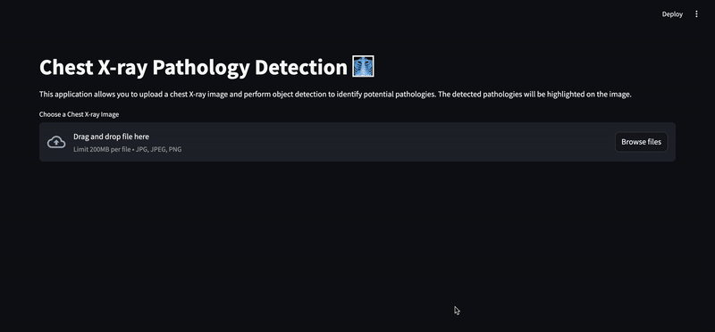

# chest-xray-detection



## Table of Contents

- [Features](#features)
- [Installation](#installation)
  - [Library requirements](#library-requirements)
  - [Pyenv](#pyenv)
  - [Poetry](#poetry)
  - [Pre-commit setup](#pre-commit-setup)
- [Continuous Integration](#continuous-integration)
- [Usage](#usage)
- [Code organisation](#code-organisation)
- [Training](#training)

## Features

- Upload chest X-ray images for analysis
- View detection results with bounding boxes and prediction scores
- Easily visualize and interpret results

## Installation

### Library requirements

- Python 3.10.5
- Poetry 1.8.2


### Pyenv
Some ubuntu installs needed which should be installed before installing `python` with `pyenv`:
```
sudo apt-get install libffi-dev
sudo apt-get install libsqlite3-dev
```

 We use pyenv to manage python, currently version `3.10.5`:
```bash
# download pyenv
curl https://pyenv.run | bash

# install python
pyenv install 3.10.5

# select python
pyenv global 3.10.5
```

### Poetry

Install `Poetry 1.8.2` on your root system
```bash
curl -sSL https://install.python-poetry.org | python3 - --version 1.8.2
```

Install all module dependencies inside `pyproject.toml`.

```bash
poetry install

# activate virtual environment
poetry shell
```

**Note** : If you activate your environment within your shell with `poetry shell`, you can execute all your commands directly without specifying `poetry run` first.

Select venv in VSCode located at `/home/ubuntu/.cache/pypoetry/virtualenvs`

### Pre-commit setup

Pre-commit modify your code file with some tools (black for example) before each commit:

```bash
poetry run pre-commit install
```

You can run pre-commit manually with

```bash
poetry run pre-commit run --all-files
```

## Continuous Integration

A Continuous Integration (CI) pipeline has been implemented to streamline our development workflow. This CI setup ensures that each code change undergoes rigorous automated testing before integration into the main branch.


## Usage

1. Download the model weights:
    ```bash
    pip install --upgrade pip
    pip install gdown
    gdown 1xj44hXRfNeCyPgyaA1bsbleHJCuAFh82
    mkdir chest_xray_detection/ml_detection_api/domain/models
    mv faster_rcnn_r50_fpn.pt chest_xray_detection/ml_detection_api/domain/models/faster_rcnn_r50_fpn.pt
    ```

2. Launch the `FastAPI` application:
    ```bash
    scripts/run_fastapi.sh
    ```
    or
    ```bash
    fastapi run chest_xray_detection/ml_detection_api/application/api.py
    ```

3. Launch the `FastAPI` application:
    ```bash
    scripts/run_streamlit.sh
    ```
    or
    ```bash
    streamlit run app.py
    ```

4. Open your browser and go to `http://localhost:8501`

5. Upload a chest X-ray image and view the detection results.

## Code organisation


Source code is available within `chest_xray_detection` package, with the following arborescence:

```text
chest_xray_detection
  |___ ml_detection_api          # Contains code for the API
        |___ application
        |___ configs
        |___ domain
        |___ infrastructure
        |___ utils

  |___ ml_detection_detection_develop       # Contains code for training and evaluate models (detection and classification)
        |___ configs
        |___ dataset
        |___ losses
        |___ metrics
        |___ models
        |___ optimizer
        |___ train
        |___ utils

scripts                          # Scripts for running the API and other tasks
tests                            # Unit test files for ensuring code quality and functionality
```

## Training

For more detailed information about the model training procedure, please refer to the [README file](chest_xray_detection/ml_detection_develop/README.md)  in the ml_detection_develop directory.

## Further improvements

- [ ] Create a Docker Image.
- [ ] Adding integration tests.
- [ ] DVC for model and data versionning.
